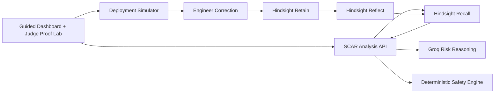

# SCAR: Production's Immune System

SCAR is a deployment-risk agent that turns production incidents, failed fixes, and engineer corrections into active organizational memory. Before approving a future deployment, it recalls causally similar failures and prevents the organization from repeating them.

**Live demo:** https://scar-production-immune-system.vercel.app

**Repository:** https://github.com/AvnishR4j/scar-production-immune-system

The guided demo proves a complete Hindsight learning loop:

1. **Cold start:** SCAR approves a dangerous payment retry-policy change because it has no relevant organizational memory.
2. **Corrective event:** The simulated deployment causes an outage and an engineer explains the true root cause.
3. **Hindsight learns:** SCAR retains the incident and reflects on the reusable production-safety lesson.
4. **Recurrence blocked:** SCAR identifies the same hidden failure mechanism in an unrelated notification service and blocks deployment.

## Interactive Judge Proof Lab

The Proof Lab makes the learning claim falsifiable instead of relying only on the guided story:

1. A judge writes an unseen deployment challenge and sees its locked input fingerprint.
2. SCAR analyzes it against a newly created empty memory bank and must cite zero evidence.
3. The judge writes the root cause and successful resolution in their own words.
4. SCAR retains that correction, then re-analyzes the exact same locked challenge.
5. The interface exposes the before/after verdicts, raw recalled memory IDs, document IDs, timestamps, and evidence count.

The status badge only changes to **Verified Memory** after all retain and recall operations complete through Hindsight Cloud. Without Hindsight credentials, the app explicitly labels the result **Simulation Mode** and does not present it as proof of persistent learning.

SCAR also rejects false learning: retaining an unrelated judge-authored lesson does not block the deployment. The Proof Lab learns only from the visible root cause and resolution fields, a verdict can change only when recalled evidence has causal overlap with the proposed change, and every model-generated `BLOCK` decision must cite an ID that was actually returned by memory recall.

## Why Memory Changes the Decision

Traditional postmortems preserve what happened as documents. SCAR uses Hindsight to make those lessons change future decisions.

The first and second proposed changes affect different services and dependencies. Their keywords barely overlap, but their causal mechanism is the same: deterministic retries synchronize workers and exhaust a constrained downstream resource.

SCAR recalls that causal lesson and transfers it across domains.

## Hindsight Memory Loop

When Hindsight Cloud is configured, SCAR uses a separate, isolated memory bank for each demo session:

| Stage | Hindsight operation | Result |
| --- | --- | --- |
| Cold start | `recall` | No relevant incident evidence exists, so SCAR approves the change |
| Corrective event | `retain` | Stores the incorrect diagnosis, root cause, resolution, causal chain, and guardrails |
| Learning | `reflect` | Generalizes the payment incident into a reusable retry-synchronization lesson |
| Future deployment | `recall` | Retrieves the lesson for a different service and changes the verdict to `BLOCK` |

The decision changes because of recalled organizational evidence, not because the second change contains the same service names or incident keywords.

## Architecture



- **Next.js App Router:** dashboard and server-side API routes
- **Hindsight Cloud:** isolated memory bank per demo session using `retain`, `recall`, and `reflect`
- **Groq:** structured risk analysis when configured
- **Deterministic safety engine:** reliable fallback for development and demo recovery
- **Deployment simulator:** controlled outage narrative; no production infrastructure is modified

## Integration Modes

The interface always displays the active integration mode:

- **Hindsight Cloud + Groq:** real persistent-memory operations and model-based risk reasoning when credentials are configured.
- **Deterministic demo mode:** preserves the complete guided flow when external providers are unavailable and is clearly labeled in the dashboard.

The public deployment can be evaluated without credentials, but it will explicitly show **Simulation Mode**. For a verified Hindsight-backed run, configure the server-side environment variables below and redeploy.

## Run Locally

```bash
npm install
cp .env.example .env.local
npm run dev
```

Open [http://localhost:3000](http://localhost:3000).

The app works immediately in deterministic demo mode. Add Hindsight Cloud and Groq credentials to `.env.local` to enable the live integrations:

```bash
HINDSIGHT_BASE_URL=https://your-hindsight-api
HINDSIGHT_API_KEY=your-key
GROQ_API_KEY=your-key
GROQ_MODEL=openai/gpt-oss-120b
SCAR_SESSION_SECRET=a-random-secret-of-at-least-32-bytes
```

`HINDSIGHT_BASE_URL` must use HTTPS in production. HTTP is accepted only for `localhost` and `127.0.0.1`.

## Deploy to Vercel

```bash
vercel
vercel env add HINDSIGHT_BASE_URL production
vercel env add HINDSIGHT_API_KEY production
vercel env add GROQ_API_KEY production
vercel env add SCAR_SESSION_SECRET production
vercel --prod
```

Generate the signing secret with:

```bash
openssl rand -hex 32
```

## Demo Script

1. Click **Analyze with empty memory** and show that the Hindsight inspector contains zero relevant memories.
2. SCAR approves the payment change because automated checks pass and it has no learned incident evidence.
3. Click **Deploy approved change** to show the retry-wave outage.
4. Click **Teach SCAR the resolution** and show Hindsight retain, reflect, the generalized mental model, and extracted entities.
5. Click **Analyze unrelated deployment** to show SCAR recalling INC-104 and blocking the notification-worker change.
6. Emphasize that SCAR learned the causal mechanism, not a service name or keyword.
7. In **Interactive Judge Challenge**, create a new empty proof bank and let a judge edit the challenge and correction.
8. Run the three proof actions and show that the locked fingerprint is identical while the verdict changes only after raw Hindsight evidence is recalled.

## API Contracts

| Endpoint | Purpose |
| --- | --- |
| `POST /api/demo/start` | Creates an isolated Hindsight memory bank |
| `POST /api/analyze` | Recalls memories and returns a risk verdict |
| `POST /api/deploy` | Runs the controlled outage simulation |
| `POST /api/incident/retain` | Retains the correction and reflects on the lesson |

## Verification

```bash
npm test
npm run lint
npm run build
npm audit
```

## Safety and Transparency

- The outage and deployment are intentionally simulated for a reliable demonstration.
- Hindsight retain, recall, and reflect operations are real when cloud credentials are configured.
- API keys remain server-side.
- Every public visitor receives an isolated memory bank.
- Costly API operations require an expiring server-signed demo session.
- API routes enforce same-origin requests, body-size limits, response bounds, and best-effort per-IP throttling.
- Production responses include CSP, HSTS, frame, MIME-sniffing, referrer, and permissions protections.
- Hindsight URLs must use HTTPS outside local development.
- The dashboard labels fallback integration states when credentials or providers are unavailable.

Current verification: `14` automated tests passing and `0` dependency vulnerabilities reported by `npm audit`.

## Official Hindsight Resources

- [Hindsight repository](https://github.com/vectorize-io/hindsight)
- [Hindsight documentation](https://hindsight.vectorize.io/)
- [Vectorize agent memory](https://vectorize.io/what-is-agent-memory)

## License

MIT
