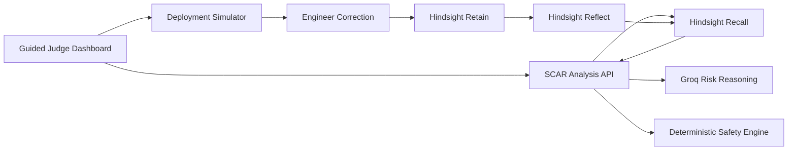

# SCAR: Production's Immune System

SCAR is a deployment-risk agent that turns production incidents, failed fixes, and engineer corrections into active organizational memory. Before approving a future deployment, it recalls causally similar failures and prevents the organization from repeating them.

**Live demo:** https://scar-production-immune-system.vercel.app

The guided demo proves a complete Hindsight learning loop:

1. **Cold start:** SCAR approves a dangerous payment retry-policy change because it has no relevant organizational memory.
2. **Corrective event:** The simulated deployment causes an outage and an engineer explains the true root cause.
3. **Hindsight learns:** SCAR retains the incident and reflects on the reusable production-safety lesson.
4. **Recurrence blocked:** SCAR identifies the same hidden failure mechanism in an unrelated notification service and blocks deployment.

## Why Memory Changes the Decision

Traditional postmortems preserve what happened as documents. SCAR uses Hindsight to make those lessons change future decisions.

The first and second proposed changes affect different services and dependencies. Their keywords barely overlap, but their causal mechanism is the same: deterministic retries synchronize workers and exhaust a constrained downstream resource.

SCAR recalls that causal lesson and transfers it across domains.

## Architecture



- **Next.js App Router:** dashboard and server-side API routes
- **Hindsight Cloud:** isolated memory bank per demo session using `retain`, `recall`, and `reflect`
- **Groq:** structured risk analysis when configured
- **Deterministic safety engine:** reliable fallback for development and demo recovery
- **Deployment simulator:** controlled outage narrative; no production infrastructure is modified

## Run Locally

```bash
npm install
cp .env.example .env.local
npm run dev
```

Open [http://localhost:3000](http://localhost:3000).

The app works immediately in deterministic demo mode. Add Hindsight Cloud and Groq credentials to `.env.local` to enable the live integrations:

```bash
HINDSIGHT_BASE_URL=https://your-hindsight-api
HINDSIGHT_API_KEY=your-key
GROQ_API_KEY=your-key
GROQ_MODEL=openai/gpt-oss-120b
SCAR_SESSION_SECRET=a-random-secret-of-at-least-32-bytes
```

## Demo Script

1. Click **Analyze with empty memory** and show that the Hindsight inspector contains zero relevant memories.
2. SCAR approves the payment change because automated checks pass and it has no learned incident evidence.
3. Click **Deploy approved change** to show the retry-wave outage.
4. Click **Teach SCAR the resolution** and show Hindsight retain, reflect, the generalized mental model, and extracted entities.
5. Click **Analyze unrelated deployment** to show SCAR recalling INC-104 and blocking the notification-worker change.
6. Emphasize that SCAR learned the causal mechanism, not a service name or keyword.

## API Contracts

| Endpoint | Purpose |
| --- | --- |
| `POST /api/demo/start` | Creates an isolated Hindsight memory bank |
| `POST /api/analyze` | Recalls memories and returns a risk verdict |
| `POST /api/deploy` | Runs the controlled outage simulation |
| `POST /api/incident/retain` | Retains the correction and reflects on the lesson |

## Verification

```bash
npm test
npm run lint
npm run build
```

## Safety and Transparency

- The outage and deployment are intentionally simulated for a reliable demonstration.
- Hindsight retain, recall, and reflect operations are real when cloud credentials are configured.
- API keys remain server-side.
- Every public visitor receives an isolated memory bank.
- Costly API operations require an expiring server-signed demo session.
- API routes enforce body-size limits, response bounds, and best-effort per-IP throttling.
- The dashboard labels fallback integration states when credentials or providers are unavailable.

## Official Hindsight Resources

- [Hindsight repository](https://github.com/vectorize-io/hindsight)
- [Hindsight documentation](https://hindsight.vectorize.io/)
- [Vectorize agent memory](https://vectorize.io/what-is-agent-memory)

## License

MIT
